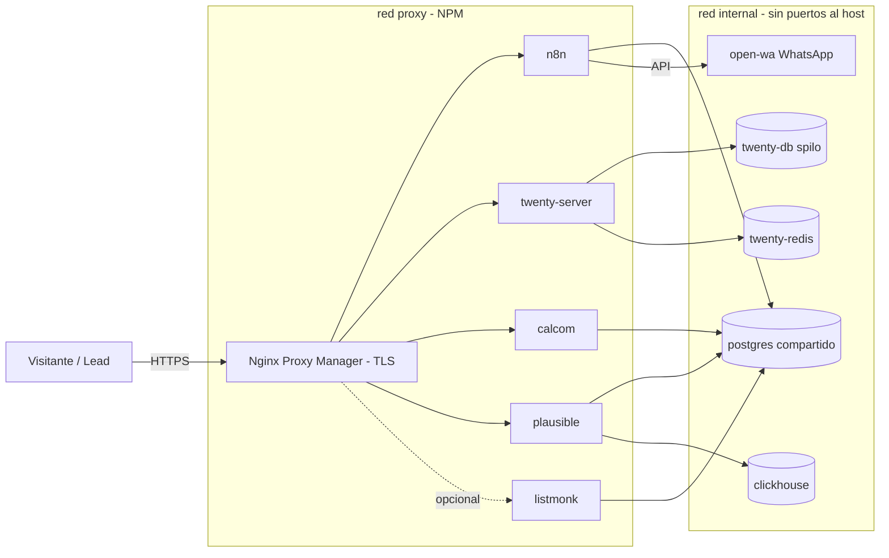

# mkt-stack — CustOS

Stack self-hosted **open source** para el motor de marketing y ventas de CustOS
(sistema operativo para empresas de seguridad privada, Argentina), pensado para correr
en **un solo VPS detrás de un Nginx Proxy Manager (NPM) ya existente** — sin Caddy ni
Traefik: NPM hace el TLS.

## Componentes (todo OSS)

| Servicio | Imagen (pineada, footprint mínimo) | Rol |
|---|---|---|
| **n8n** | `n8nio/n8n` (alpine) | Automatización: form → Twenty → Listmonk → WhatsApp |
| **Twenty** | `twentycrm/twenty` + spilo PG + `redis:alpine` | CRM / pipeline de demos |
| **Cal.com** | `calcom/cal.com` | Agenda de demos (embebible en la landing) |
| **Listmonk** | `listmonk/listmonk` (binario Go) | Email: prospección, nurture, newsletter |
| **Plausible** | `community-edition` + `clickhouse:alpine` | Analítica web sin cookies |
| **open-wa** | `openwa/wa-automate` | API de WhatsApp para n8n (solo red interna) |
| Postgres compartido | `postgres:16-alpine` | Bases de n8n, calcom, listmonk, plausible |

> **Footprint:** se usan variantes `alpine`/`slim` en todo lo que las tiene (Postgres,
> Redis, ClickHouse) y ClickHouse queda afinado para bajo consumo (`clickhouse/`).
> Twenty, Cal.com y Plausible son apps Node/Elixir sin variante alpine oficial: se usan
> sus imágenes upstream más chicas, con tag fijo (nada de `latest`).

## Contenido del repo

```
docker-compose.yml          # el stack completo
.env.example                # todas las variables (copiar a .env)
scripts/gen-secrets.sh      # genera .env con secretos aleatorios del largo correcto
Makefile                    # up / down / logs / pull / backup / wa-qr ...
postgres/init/              # crea una base por servicio en el 1er arranque
clickhouse/                 # config de bajo consumo para Plausible
.github/workflows/publish-images.yml # espeja las imágenes a tu GHCR (no toca el VPS)
prompts/01-stack.md         # prompt que generó este stack
prompts/02-captura-demo.md  # siguiente paso: n8n + landing que convierte
```

## Requisitos previos

- VPS Linux con Docker + Docker Compose v2 y **mínimo 8 GB RAM** (ideal 16).
- Nginx Proxy Manager corriendo, conectado a una red Docker compartida.
- Registros DNS tipo **A** por subdominio → IP del VPS.
- Relay SMTP (Brevo o Amazon SES). El stack **no** monta MTA propio.
- Un número de WhatsApp **dedicado** para open-wa (no el comercial principal).

## Puesta en marcha

```bash
git clone https://github.com/pel-matiasvaldivia/mkt-stack.git
cd mkt-stack

# 1) Red compartida con NPM (usar el nombre real de la red de tu NPM)
docker network create npm_network   # si no existe; y conectá tu NPM a ella

# 2) Secretos + config
./scripts/gen-secrets.sh            # crea .env con secretos aleatorios
$EDITOR .env                        # completar dominios, NPM_NETWORK y SMTP

# 3) Levantar
make pull
make up
make ps
```

### Proxy Hosts a cargar en Nginx Proxy Manager

Un Proxy Host por servicio (Forward Hostname = nombre del contenedor):

| Dominio | Forward → | Websockets | Force SSL |
|---|---|---|---|
| `n8n.tudominio.com` | `n8n:5678` | ✅ ON | ✅ |
| `crm.tudominio.com` | `twenty-server:3000` | ✅ ON | ✅ |
| `cal.tudominio.com` | `calcom:3000` | ✅ ON | ✅ |
| `analytics.tudominio.com` | `plausible:8000` | — | ✅ |
| `mail.tudominio.com` *(opcional)* | `listmonk:9000` | — | ✅ |

`open-wa` **no** se publica: queda solo en la red interna, lo consume n8n.

### Orden de inicialización (primer arranque)

1. **open-wa / WhatsApp:** `make wa-qr` y escaneá el QR que aparece en los logs con el
   número dedicado. La sesión queda persistida en su volumen.
2. **Twenty:** entrá a `crm.tudominio.com` y creá el workspace/usuario admin.
3. **Cal.com:** primer usuario en `cal.tudominio.com` (corre migraciones al arrancar).
4. **Listmonk:** login con `LISTMONK_ADMIN_USER/PASSWORD` del `.env`.
5. **Plausible:** primer usuario en `analytics.tudominio.com` y creá el sitio; copiá el
   snippet de tracking para la landing (lo usa `prompts/02-captura-demo.md`).

## Imágenes en GitHub (GitHub Actions → GHCR)

El CI **no se conecta a tu servidor**. `.github/workflows/publish-images.yml` valida el
compose y **espeja las imágenes pineadas** del stack al GitHub Container Registry
(GHCR) de tu cuenta: `ghcr.io/pel-matiasvaldivia/mkt-stack/<servicio>:<tag>`. Vos, desde
el VPS, solo hacés `docker compose pull` y bajás las imágenes ya listas.

Cómo trabaja (footprint mínimo):

- **Matrix:** cada imagen se espeja en su propio runner (sin presión de disco).
- **Idempotente:** si el tag ya existe en GHCR, no se re-sube (los tags rara vez cambian
  → la mayoría de las corridas no suben nada).
- No deja capas en el runner (se limpian al terminar cada job).
- No necesita ningún secret: usa el `GITHUB_TOKEN` propio de la Action para pushear.

El compose apunta a GHCR vía la variable `REGISTRY` del `.env`
(`REGISTRY=ghcr.io/pel-matiasvaldivia/mkt-stack`).

### En tu servidor

```bash
# 1) Las imágenes deben ser accesibles. Lo más simple: hacer PÚBLICO cada
#    package en GitHub (Profile → Packages → cada uno → Package settings →
#    Change visibility → Public). Así no hace falta login.
#
#    Si preferís mantenerlos privados, logueate una vez en el VPS con un PAT
#    de scope `read:packages`:
#    echo $GHCR_PAT | docker login ghcr.io -u pel-matiasvaldivia --password-stdin

# 2) Bajar las imágenes ya publicadas y levantar
docker compose pull
docker compose up -d
```

> El primer push a `main` (o correr el workflow a mano con **Run workflow**) publica
> las 10 imágenes. Las corridas siguientes solo suben lo que haya cambiado de tag.

## Backups

`make backup` vuelca el Postgres compartido y el de Twenty a `./backups`. Para historial
de analytics agregar el dump de ClickHouse/Plausible según necesidad.

## Arquitectura



## Orden de ejecución de los prompts

1. [`prompts/01-stack.md`](prompts/01-stack.md) — generó **este** stack.
2. [`prompts/02-captura-demo.md`](prompts/02-captura-demo.md) — siguiente paso: arregla
   el formulario de la landing y arma el workflow `form → Twenty → Listmonk → WhatsApp`
   en n8n. Correr **después** de tener el stack arriba y los Proxy Hosts en NPM.

## Origen

Deriva del `PLAN_MARKETING_CUSTOS.md` y `GUION_LANZAMIENTO_CUSTOS.md` del producto.
Regla heredada: **no inventar métricas** — apoyarse en lo verificable del producto
(dotación ≈4,2, freno de credencial vencida, datos aislados por tenant).
